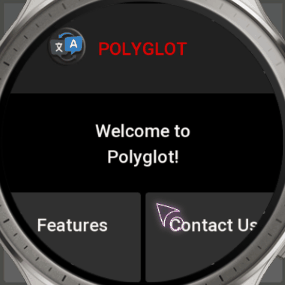
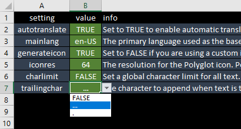
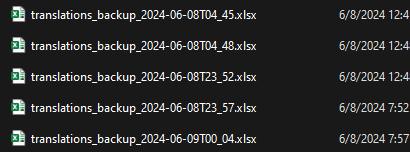
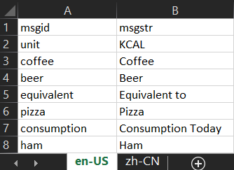
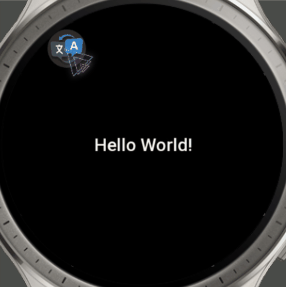
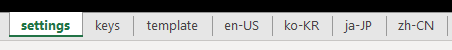
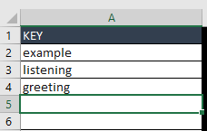
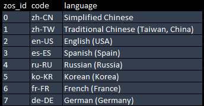
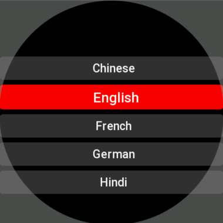

# 🌐 Polyglot - The Ultimate Localization Toolkit for ZeppOS

### Description
The `Polyglot` library is the ultimate solution for managing localizations in `ZeppOS` mini apps. Offering dynamic translation loading, language switching on-the-fly, and a user-friendly UI for language selection, `Polyglot` makes it super easy to cater to a global audience. With support for an extensive range of languages and an intuitive API, `Polyglot` helps developers effortlessly integrate multi-language support into their apps, enhancing the user experience for non-English speaking users.



### 
  >💡 Interesting fact: Even in the US, 20% speak another language. 🌐 Polyglot makes ZeppOS apps go global and welcomes everyone, everywhere.

### Strong Sides of Polyglot
- 🌍 Autotranslation of your mini app to 10+ languages within seconds
- 🔀 Real-time Language switching
- 🔄 Smart Language Mapping
- 📄 Easy translation management with a single Excel file
- 🛠️ Autogeneration of Language Files
- 📣 Event-Driven Localization
- ⚡ Quick integration with your mini app

### Real-life example: Mini Chess app on Bip 5


## Navigation
#### [ [📁 Download Examples](https://github.com/silver-zepp/polyglot/archive/refs/heads/master.zip) ]
#### [[ 🚀 Quick Start ]](#quickstart)
#### [[ ⚙️ How Polyglot Works ]](#howitworks)
#### [[ 🏛️ Architecture ]](#architecture)
#### [[ 💡 Important Notes ]](#extranotes)
#### [[ 📝 API Reference ]](#apireference)

### Installation
To integrate `Polyglot` library into your project, first, install `Polyglot` library system-wide:

```bash
npm i @silver-zepp/polyglot -g
```
💡Note the `-g` global flag

Then install the library inside any of your mini apps by running `poly init` from the root of your project.

### Requirements
An `Amazfit` watch running `ZeppOS v2` or higher.

For the convenience of managing all your translations in one place, `Polyglot` utilizes an Excel format `.xlsx` file. If you don't have Microsoft Office installed, you can use one of these free alternatives to work with `.xlsx` files:
- [Libre Office](https://www.libreoffice.org/download/download-libreoffice/)
- [WPS Office](https://www.wps.com/download/)

## 🎥 Video tutorial
### Learn how to port your existing project to `Polyglot` using our [Calories 2.0 sample](https://github.com/zepp-health/zeppos-samples/tree/main/application/2.0/calories)
<a href="https://www.youtube.com/watch?v=CcOU0V2A9xc">
  
</a>

## 🚀 Quick Start <a id="quickstart"></a>
1. Install the library `npm i @silver-zepp/polyglot -g`
2. Navigate into your mini app root folder and run `poly init`
2. Run `poly trans`
3. Setup the translations [ [Learn More](#translationssetup) ]
4. Run `poly gen`
5. Implement `Polyglot` in your mini app [[ Example code ]](#example)
6. Done!

## 📚 How Polyglot Works <a id="howitworks"></a>

Using `Polyglot` involves two main steps: setting up and generating translations with the `poly` utility, and then importing and using the `Polyglot` class in your mini app for localization.

### 1. Setting Up Translations with `poly` CLI tool

The `poly` tool is equipped with a set of command-line programs designed to manage your translations effortlessly. Here's how to use it:

- **poly init**: 
    Initializes your project for use with `Polyglot` by setting up necessary files and dependencies. This is a mandatory first step before using any other `Polyglot` commands.

    ```bash
    poly init
    ```
    This command sets up the `polyglot` directory in your project, copies the global `translations.xlsx` to your project for local modifications, updates your project's dependencies, and ensures the `Polyglot` library is correctly installed.

- **poly trans**: 
    Opens the `translations.xlsx` file where you can add, edit your keys and translations, as well as configure the translator's behavior.

    ```bash
    poly trans
    ```
    Use this command for direct editing of your translations spreadsheet. It's essential for managing your translation keys and their corresponding translations.
    
    <br>

- **poly gen**: 
    Generates translation JSON files from the `translations.xlsx` for each device your app is built for. It auto-translates text to all specified languages in the spreadsheet.

    ```bash
    poly gen
    ```
    This utility processes your source translation files and creates new translation assets that your mini app can utilize.

    Additionally, it generates specified poly icons.
 
    NOTE: When a cell inside translation.xlsx has any value `poly gen` will `NOT` overwrite it. This is made to make sure that the auto translator won’t overwrite your manual changes. If you would like to trigger the cell’s translation, make sure it’s empty.

- **poly backups**: 
    Opens the `backups` directory where your translation backups are stored. 

    ```bash
    poly backups
    ```
    Use this command to access your translation backups, providing a safety net in case of issues with the current `translations.xlsx` file.
    
    <br>

- **poly parse**: 
    Parses `.po` files from the `i18n` folder and generates an Excel file, helping you to quickly switch from a the old static `i18n` translation method to a dynamic `polyglot`.

    ```bash
    poly parse
    ```
    After executing this command you can quickly incorporate your old strings into the `translations.xlsx`.

    <br>

- **poly version**: 
    Displays the current version of the `Polyglot` module installed in your system and the project.

    ```bash
    poly version
    ```
    This command will show you the `system` module version, the `project` module version, and the latest `online` module version available on npm. It's a useful check to ensure that your `Polyglot` tool is up to date.

Each of these commands is designed to simplify the management and generation of translations for your mini app, ensuring a smooth workflow for localizing content across different languages.
	

### 2. Using the `Polyglot` Class in Your Mini App

After setting up your translations, you can use the `Polyglot` class in your mini app to switch languages and retrieve localized texts.

Import the `Polyglot` class and use it in your mini app. Here's a simple "Hello World" example: <a id="example"></a>

```js
import { Polyglot } from "@silver-zepp/polyglot";

// create a new instance of Polyglot
const poly = new Polyglot();

// retrieve a localized greeting message
const greeting = poly.getText("hello");

// show the language switcher icon
poly.showPolyBubble("top-right");

// display the greeting message
console.log(greeting); // output: "Hello, World!" if your default language is English
                       // or: "Bonjour, le monde!" when you switch to French

// register a listener for language change events
poly.onLanguageChange((language, texts) => {
    // log the text that is assigned to "hello" key every time language changes
    console.log(texts["hello"]);
});
```

In this example, `getText` is a method of `Polyglot` that retrieves the translation for a given key (in this case, "hello").

Here's a visual "Hello World" example:<br/>


Here's how it looks in code:<br/>
```js
const text_widget = createWidget(widget.TEXT, {
	...TEXT_STYLE,
	text: poly.getText("greeting")
});

poly.showPolyBubble();

poly.onLanguageChange((language, texts) => {
  text_widget.setProperty(prop.TEXT, texts["greeting"]);
});
```

### Explanation of `translations.xlsx` setup: <a id="translationssetup"></a>
The `translations.xlsx` file serves as the configuration and content source for the `Polyglot` library. It contains several tabs/sheets that allow you to customize the translation process:<br/>


#### Settings Tab
This tab allows you to configure various options for the translation generation. Each `value` is a drop-down list:

| Setting      | Default | Description |
|--------------|-------|-------------|
| autotranslate | `TRUE`  | Set to `FALSE` to disable automatic translations using Google Translate. |
| mainlang     | `en-US` | The primary language used as the base for translations. |
| generateicon | `TRUE`  | Set to `FALSE` if you are using a custom icon or don't need the `Polyglot` icon. |
| iconres      | `64`    | The resolution for the `Polyglot` icon. Possible values are 32, 48, 64, 96 or 128 px. |
| charlimit    | `FALSE` | Set a global character limit for all text. Individual limits can be set in the "LIMIT" cell. |
| trailingchar | `…`     | The character to append when text is truncated by the character limit. Set to `FALSE` to disable. |
| apikey | `null` | Leave empty if you don't plan to translate walls of text. Otherwise provide Google Cloud API key. |

#### Keys Tab
Contains the translation keys used in your mini app. Populate it with your keys `example`, `hello_world`, `SomeLongTEXT`, etc.<br/>


#### Template Tab
This tab is a pre-formatted template for new language sheets. Copy this template and rename it using the language `code` from the `settings` sheet (e.g., `ja-JP`).<br/>


#### Language Tabs (e.g., en-US)
Each language tab should be named after the language code and contains the following columns:

| KEY       | TEXT            | LIMIT |
|-----------|-----------------|-------|
| example   | Example text (REPLACE ME) | 0     |
| listening | Listening       | 0     |
| greeting  | Hello World!    | 0     |

- **KEY**: Mirrored from the `keys` tab, these are the identifiers for your translations.
- **TEXT**: For the main language sheet (as defined in `settings` -> `mainlang` value cell), this should be filled with the default text for each key.
- **LIMIT**: An optional manual character limit for individual texts. If exceeded, the text will be truncated to this limit and the `trailingchar` from the settings will be appended.

To use `translations.xlsx`:
1. Fill in the settings tab with your preferred configurations.
2. Add your translation keys to the "keys" tab.
3. Provide the default text for each key in the main language tab.
4. (Optionally) Use the template tab to create new language sheets or remove the ones you don't need.
5. Save and close the `translations.xlsx` file.
6. Run `poly gen` to generate the translation files.

# 🏛️ Polyglot Library Architecture <a id="architecture"></a>

## Assets Folder Structure
#### When `poly gen` is executed, it processes your source `translations.xlsx` file and creates new translation `.json` assets. Here's an overview of the file structure that will be generated in the assets folder:
    assets/
    ├── raw/
    │   ├── polyglot/
    │   │   ├── translations/
    │   │   │   ├── en-US.json
    │   │   │   ├── es-ES.json
    │   │   │   ├── fr-FR.json
    │   │   │   └── ...
    │   │   └── poly-selector.png
    ...  ... 

## JSON Translations Contents
#### The JSON translation files contain key-value pairs where the key is a unique identifier for a string, and the value is the translated text for the particular locale. These files are used by the mini app to display text in the user's preferred language.

### `en-US.json`
Example translations for American English.
```json
{
  "example": "Example text",
  "greeting": "Hello World!",
  "app_title": "Awesome Mini App",
  "header": "Welcome to ZeppOS",
  "polyglot": "Polyglot"
}
```
### `fr-FR.json`
Example translations for French.
```json
{
  "example": "Exemple de texte",
  "greeting": "Bonjour le monde!",
  "app_title": "Mini-application géniale",
  "header": "Bienvenue à ZeppOS",
  "polyglot": "Polyglotte"
}
```

## Backups
#### When you execute `poly gen` it creates a new backup `.xlsx` file. If you run it twice in the same minute, it will overwrite the file, otherwise it will create a new one. Poly selector image is available in 6 resolutions `32`, `48`, `64`, `96` and `128` px. You can specify its resolution or disable its generation in the `settings` sheet after running `poly trans`. By default it generates `64 px` icon. Folder structure:
    polyglot/
    ├── backups/
    │   ├── translations_backup_2024-06-01T12_01.xlsx
    │   ├── translations_backup_2024-06-02T12_02.xlsx
    |   └── ...
    └── translations.xlsx

## Language Detection and Fallback Strategies
`Polyglot` uses an intelligent language detection mechanism that automatically selects the appropriate language for the user based on system settings or saved preferences. If a translation is not available for the detected language, `Polyglot` employs a fallback strategy to provide a seamless user experience. Here's how it works:

- **Automatic Language Detection**: Based on watch's system settings, the most suitable language is chosen for the user.
- **Adaptive Language Selection**: `Polyglot` automatically aligns the app's language with the user's updated system settings, ensuring that user can change app's language even if its developer haven't implemented a manual switch inside their app.
- **Saved Preferences**: User-selected language preferences are stored and retrieved upon the next application load.
- **Fallback Mechanism**: In the absence of a translation for the preferred language, `Polyglot` will fall back to a related language or a default language, that is defined in the `app.json`.
- **Related Languages**: `Polyglot` can map closely related languages and dialects to each other, ensuring that users receive the most understandable translation possible.

This approach ensures that the mini app remains usable and understandable, even if translations for a user's primary language are not yet implemented.

# 💡 Important Notes (FAQ) <a id="extranotes"></a>
    1. If clicking on the Language Switcher icon does nothing, make sure you execute poly.showPolyBubble() call after all other GUI elements were drawn

    2. Currently Polyglot does not support App Side translations

    3. If running `poly version` returns two different `system/local` versions, running any poly command ie `poly gen` will automatically update your local polyglot library per project

    4. When running poly gen and a cell inside translation.xlsx has any value, the script won't touch it. This is made to make sure that the auto translator won't overwrite your manual changes in the excel file. If you would like to trigger the cell's translation, make sure it's empty.

    5. If the autotranslation doesn't work, you might have to use a VPN to make sure you can access Google services

# 📝 Polyglot API Reference <a id="apireference"></a>

### `getText(key)`

Retrieves the translation text for a given key in the current language.

#### Parameters
- `{string} key` - The key for the translation entry.

#### Examples
```js
// example: get translation for the "hello" key
const greeting_text = poly.getText("hello");
console.log(greeting_text); // "Hello there!"
```

---

### `setLanguage(language, restart_app = false)`

Sets the current language for the mini app and loads the corresponding translation file. Optionally restarts the mini app if necessary.

#### Parameters
- `{string} language` - The language code to switch to.
- `{boolean} [restart_app=false]` - Determines whether the mini app should restart after changing the language.

#### Examples

```js
// example: change the language to French
poly.setLanguage("fr-FR");

// advanced example: change the language to Japanese and restart the app
poly.setLanguage("ja-JP", true);
```

---

### `getLanguage()`

Retrieves the current language code.

#### Examples

```js
// example: get the current language
const cur_lang = poly.getLanguage();
console.log(cur_lang); // "en-US"
```

#### Returns
`{string}` - The current language code.

---

### `onLanguageChange(subscriber)`

Registers a callback function to be invoked when the language changes. The callback receives the new language code and the updated texts object.

#### Parameters
- `{function(string, Object)} subscriber` - The callback function to call on language changes.

#### Examples
```js
// example: subscribe to language changes
poly.onLanguageChange((language, texts) => {
  console.log(`Language changed to ${language}. Updated texts:`, texts);
});
```

---

### `showPolyBubble(options = {})`

Displays a language switcher button on the UI that allows the user to open the language picker. Provides optional settings to customize the language switcher appearance and behavior.

#### Parameters

- `{Object} [options={}]` - Optional settings to customize the language switcher appearance and behavior.
  - `{string} [options.location="top-left"]` - The location for the switcher icon on the screen. Supported values are "top-left", "top-right", "bot-left", and "bot-right".
  - `{number} [options.padding_mult=2]` - The multiplier for padding.
  - `{number} [options.icon_size=64]` - The size of the icon.
  - `{number} [options.padding]` - The padding around the icon. Defaults to 5% of the smallest screen dimension.
  - `{number|null} [options.x=null]` - The manual x-coordinate for the icon.
  - `{number|null} [options.y=null]` - The manual y-coordinate for the icon.

#### Examples

```js
// example: show language switcher at top-left with default options
poly.showPolyBubble();

// advanced example: language switcher at the bottom-right with custom padding
poly.showPolyBubble({ location: "bot-right", padding_mult: 3 });
```


---

### `hidePolyBubble()`

Hides and removes the language switcher button from the UI.

#### Examples

```js
// example: hide the language switcher
poly.hidePolyBubble();
```

---

### `showLangPicker()`

Displays a picker UI for the user to select a language from the available options. This method generates a user interface element that presents a list of language names. When a user selects a language from the list, the mini app's language is set to the chosen one, and the picker UI is removed from the screen. The picker is populated with the names of languages for which translation files are available in the mini app.

#### Examples

```js
// example: show the language picker
poly.showLangPicker();
```

<br>

---

### `getLangDisplayName()`

Gets the display name of the current language based on its code.

#### Examples

```js
// example: get the display name of the current language
const lang_name = poly.getLangDisplayName();
console.log(lang_name); // "English"
```

#### Returns
`{string|undefined}` - The display name of the language, or undefined if not found.

---

### `getSysLangName()`

Retrieves the system language name based on the system language code.

#### Examples

```js
// example: get the system language name
const sys_lang_name = poly.getSysLangName();
console.log(sys_lang_name); // "English"
```

#### Returns
`{string|undefined}` - The name of the system language, or undefined if not found.

---

### `getSysLangCode()`

Retrieves the system language code.

#### Examples

```js
// example: get the system language code
const sys_lang_code = poly.getSysLangCode();
console.log(sys_lang_code); // "en-US"
```

#### Returns
`{string|undefined}` - The system language code, or undefined if not found.

---

### `getIconResolution()`

Retrieves the current resolution of the language switcher icon.

#### Examples

```js
// example: get the current icon resolution
const icon_res = poly.getIconResolution();
console.log(icon_res); // 64
```

#### Returns
`{number}` - The current icon resolution.

---

### `getRelatedLangCode(language)`

Gets the related language code based on language relatability mapping. If no related language is found, the default mini app language is returned.

#### Parameters
- `{string} language` - The language code for which to find the related language.

#### Examples
```js
// example: get the related language code for Taiwanese
const rel_lang_code = poly.getRelatedLangCode("zh-TW");
console.log(rel_lang_code); // "zh-CN". Chinese will be returned as a closest match.
```

---

### `getAllTexts()`

Retrieves all translation texts for the current language.

#### Examples
```js
// example: get all texts for the current language
const all_texts = poly.getAllTexts();
console.log(all_texts); // { greeting: "Hello there!", goodbye: "Goodbye!", ... }
```

---

### `getSupportedLanguages()`

Gets a list of supported language codes based on the available translations.

#### Examples
```js
// example: get all supported languages
const supported_languages = poly.getSupportedLanguages();
console.log(supported_languages); // ["en-US", "fr-FR", "ja-JP", ...]
```

---

### `isLanguageSupported(language_code)`

Checks if a given language code is supported by the mini app.

#### Parameters
- `{string} language_code` - The language code to check.

#### Examples
```js
// example: check if French is supported
const is_supported = poly.isLanguageSupported("fr-FR");
console.log(is_supported); // true or false
```

---

### `setIconPath(paths)`

Sets the paths to the language switcher icon for its normal and pressed states.

#### Parameters

- `{Object} paths` - The paths to the icon image files.
  - `{string} paths.normal` - The path to the normal icon image file.
  - `{string} paths.pressed` - The path to the pressed icon image file.

#### Examples

```js
// example: set custom icons for the language switcher
poly.setIconPath({
  normal: "assets://icons/custom-lang-icon.png",
  pressed: "assets://icons/custom-lang-icon-pressed.png"
});
```

### `getAvailableTranslationsForKey(key)`

Retrieves a list of available translations for a specific key across all supported languages.

#### Parameters
- `{string} key` - The key for which to find translations.

#### Returns
`{Object[]}` - An array of objects containing the language code and the corresponding translation text for the given key.

#### Examples
```js
// example: get all translations for the "greeting" key
const available_translations = poly.getAvailableTranslationsForKey("greeting");
// [{ lang_code: "en-US", text: "Hello" }, { lang_code: "fr-FR", text: "Bonjour" }, ...]
console.log(available_translations); 
```


<br>